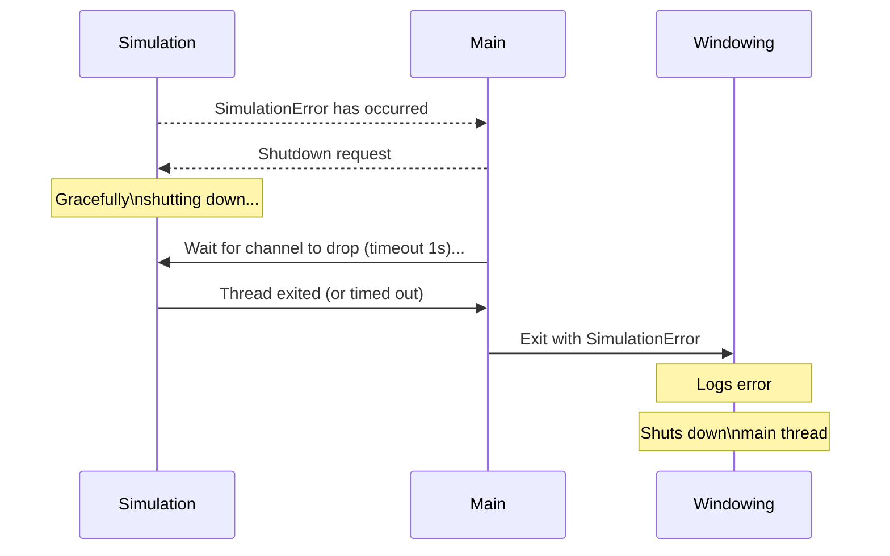

# gfx
A basic graphics library implemented in Rust. Not meant to be used for serious endeavours, instead meant as an academic exercise.

## To-do:
- [ ] Create public-facing event listening API
- [ ] Allow light creation from client
- [ ] Live-reload shader at runtime ([hot reload example](https://github.com/notify-rs/notify/tree/main/examples/hot_reload_tide))
- [ ] Rewrite mesh loading to better group vertices and coordinates using iterators instead of indices
- [ ] Text rendering support
- [ ] FPS debug rendering
- [ ] General debug menus (e.g. allow tweaking of any object in scene-graph)
- [ ] Anti-aliasing
- [ ] Mip-maps and texture filtering
- [ ] Enable shader debugging using debug symbols and Renderdoc
- [ ] Allow creation of objects during simulation loop
- [ ] Allow interaction between client UI and simulation context (requires some form of synchronization, a command buffer?)

## Architecture

The engine uses two threads:
* The main thread of the program is used for rendering and the window event loop;
* A simulation thread is used to run the code provided by the client uncoupled from the main thread.

An example of how they are orchestrated is shown below, where the shutdown flow is modeled for when a simulation error occurs:

## Setting up development environment

This project uses Rust nightly.

### Setting up pre-commit hooks
1. Install Python 3.4 or later (need it for `pip`)
2. Run `pip install pre-commit`
3. In the root directory of the project, run `pre-commit install`
4. Run `pre-commit run --all-files` to verify that it's working
